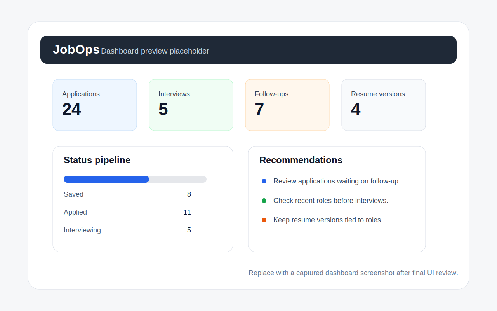
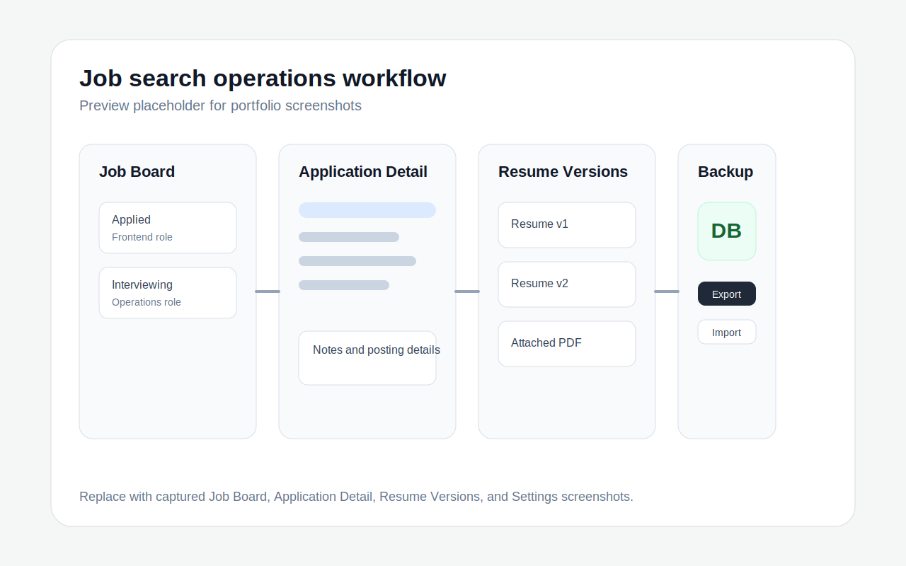

# JobOps

Track your job search like an operations pipeline.

JobOps is a local-first Expo, React Native, and TypeScript app for organizing job applications, resume versions, follow-ups, notes, and job posting details without accounts, cloud sync, analytics, scraping, external AI services, paid APIs, or a backend.

## Hero Screenshots

README preview placeholders are included below so the repository has a portfolio-ready visual layout. Replace these SVGs with finalized app screenshots after the UI capture pass.

| Dashboard Preview | Workflow Preview |
| --- | --- |
|  |  |

## Overview

JobOps treats a job search as an operational workflow instead of a loose set of notes. It gives applicants a structured place to track opportunities, monitor application status, manage resume versions, plan follow-ups, and preserve job posting details locally on their device.

The project is designed as a practical portfolio example for workflow systems, privacy-aware local tools, and lightweight operational dashboards.

## Problem

Job searches often spread across browser tabs, spreadsheets, resumes, calendar reminders, saved job descriptions, and scattered notes. That makes it easy to lose context, miss follow-ups, reuse the wrong resume version, or forget what was submitted for a specific role.

Many tools also assume accounts, cloud sync, analytics, or backend services. For a personal job-search tracker, a local-first model can be a better fit.

## Solution

JobOps provides a structured local workspace for job-search operations:

- Track each application through a status pipeline.
- Save job posting details, notes, role highlights, requirements, salary text, and work mode.
- Attach resume document metadata and track resume versions.
- Create and complete follow-up reminders.
- Export and import backups from Settings.
- Review dashboard totals, status counts, recent jobs, follow-ups, and recommendations.

## Key Features

- Dashboard with application totals, status counts, follow-ups, recent jobs, and practical recommendations.
- Job board grouped by application status with search and quick status changes.
- Application create, edit, delete, and detail screens with saved status history.
- Resume version tracking with TXT/PDF document attachment through the device file manager.
- TXT resume uploads can fill basic resume fields from file content; PDF uploads save file details for reference.
- Follow-up reminders with date editing and completion.
- Local job description helper for role highlights, salary text, work mode, and requirements.
- Plain-language backup export/import from Settings.
- Optional demo data for trying the app quickly.
- Light and dark mode through the device color scheme.

## Tech Stack

- Expo
- React Native
- TypeScript
- Expo Router
- SQLite through `expo-sqlite`
- Jest and Testing Library for React Native

## Local-First Privacy

JobOps stores structured data locally in `jobops.db` through `expo-sqlite`. Resume document references are stored as local file metadata.

The app does not use:

- Accounts or authentication
- Cloud sync
- Analytics or tracking
- Job scraping
- External AI APIs
- Paid APIs
- A backend service

Backups are exported and imported from Settings using a plain backup file format. The app keeps the format compatible internally while avoiding technical wording in the user interface.

## Architecture / Project Structure

- `app/`: Expo Router routes and tab navigation.
- `src/screens/`: Screen-level UI for dashboard, jobs, applications, resumes, reminders, and settings.
- `src/components/`: Shared UI components and theme primitives.
- `src/db/`: SQLite schema, migrations, and database access.
- `src/services/`: Import/export, parsing, recommendations, seed data, and document helpers.
- `src/types/`: Shared TypeScript types.
- `src/utils/`: Small reusable utilities.
- `assets/`: App icons, splash assets, and fonts.

## Screenshots

Screenshots can be added here after the UI is finalized. The hero preview placeholders above can be replaced with captured app screenshots when available.

| Screen | Placeholder |
| --- | --- |
| Dashboard | Add screenshot to `docs/screenshots/dashboard.png` |
| Job Board | Add screenshot to `docs/screenshots/job-board.png` |
| Application Detail | Add screenshot to `docs/screenshots/application-detail.png` |
| Resume Versions | Add screenshot to `docs/screenshots/resume-versions.png` |
| Settings / Backup | Add screenshot to `docs/screenshots/settings-backup.png` |

## Setup

Use Node.js 20.19.4 or newer.

```bash
npm install
npm run web
```

## Useful Commands

```bash
npm run android
npm run ios
npm run web
npm run typecheck
npm test
```

## Testing

Run the full local check before shipping changes:

```bash
npm run typecheck
npm test
```

Tests cover parsing helpers, recommendations, backup validation, utility behavior, and key screen rendering.

## Portfolio Case Study

### Problem

Job applications involve many small operational details: application status, follow-up timing, resume versions, saved posting context, and notes from each opportunity. Without a focused workflow, those details can become fragmented across tools.

### Solution

JobOps brings those details into one local app organized around an application pipeline. The dashboard summarizes activity, the job board groups applications by status, detail screens preserve context, and reminders keep follow-ups visible.

### Technical Approach

The app uses Expo Router for navigation, React Native components for cross-platform UI, TypeScript types for application and resume data, and SQLite persistence through `expo-sqlite`. Services handle import/export, document picking, resume parsing, job posting parsing, recommendations, and seed data. Tests focus on core helpers, backup validation, utility behavior, and important screen rendering paths.

### Impact

JobOps demonstrates how a small local-first application can support a real workflow without requiring user accounts, backend infrastructure, cloud sync, external AI services, or scraping. It presents job-search tracking as a practical operations system with clear data ownership.

### Future Improvements

- Add finalized screenshots for the public README.
- Expand test coverage around more application editing and reminder flows.
- Add more backup validation cases as the data model grows.
- Improve accessibility review across forms and dashboard cards.
- Add optional notification scheduling if supported by the target platform setup.

## Roadmap

- Finalize screenshot assets for portfolio presentation.
- Continue strengthening tests for key user flows.
- Refine dashboard recommendations as more workflow states are added.
- Keep backup import/export compatible as the schema evolves.
- Review mobile accessibility and keyboard behavior.

## Notes for Reviewers

- This is a portfolio project focused on local-first workflow design.
- The app intentionally avoids accounts, authentication, cloud sync, analytics, scraping, external AI APIs, paid APIs, and backend services.
- Demo data is optional and intended only to make the app easier to explore.
- The repository includes CI for typechecking and tests, but no deployment workflow.
